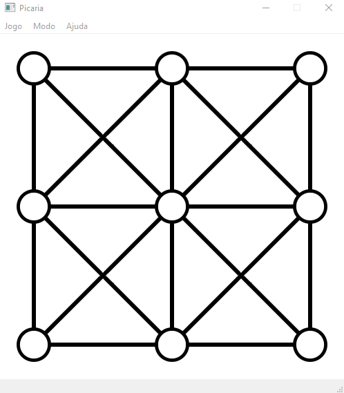
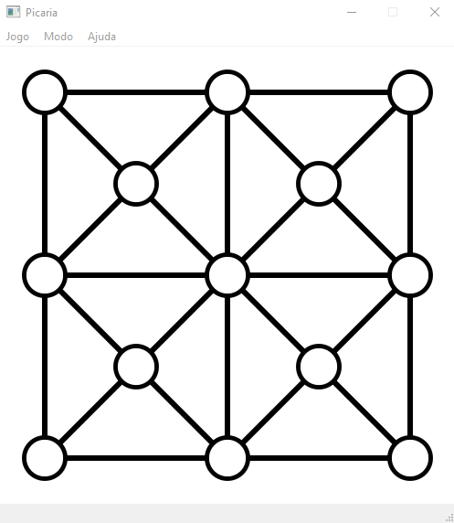
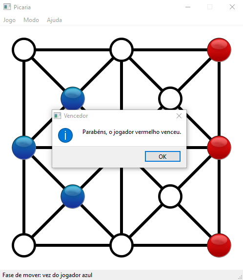

# Picaria
O objetivo desse projeto é desenvolver um jogo com o intuito de aplicar conceitos de programação orientada a eventos em um sistema computacional utilizado o [framework Qt](https://qt.io/developers) sobre C++ para criação de interfaces gráficas.

## Capturas de Tela
| Modo 09 buracos | Modo 13 buracos | Vitória |
|:-------------------------------:|:--------------------------------:|:------------------------------:|
| |  |  |

## Descrição do Picaria
Dado um tabuleiro com 4 quadrantes e 9 buracos (modo simples) ou 13 buracos (modo avançado), cada jogador recebe 3 peças iguais de uma determinada cor (azul ou vermelha). Vence o jogador que conseguir posicionar todas as suas peças em sequência primeiro.

### Gameplay
  - O jogo é dividido em duas fases: a primeira de posicionar as peças e a segunda de alterar suas respectivas posições no tabuleiro;
  - Na primeira fase, nenhuma peça poderá ter sua posição alterada depois de posicionada;
  - Na segunda fase, depois que todas as 6 peças (3 azuis e 3 vermelhas) tenham sido posicionadas, nenhuma outra poderá ser adicionada ao jogo, de modo a serem permitidas somente jogadas de alteração de posições das peças posicionadas na primeira fase.

### Regras
  - Nenhuma peça pode ser sobreposta;
  - Durante o jogo, o jogador só poderá controlar as peças que recebeu inicialmente;
  - Uma peça pode ter sua posição alterada somente para buracos adjascentes (conectadas pelas linhas indicadas no tabuleiro) que não contenham outra peça, ou seja, para uma posição válida;

## Autores
- Desenvolvedores: [Pedro Vaz](https://github.com/vazConnected) e [Ana Julia Velasque](https://github.com/anajvelasque);
- Mentor: [Andrei Rimsa](https://github.com/rimsa).
